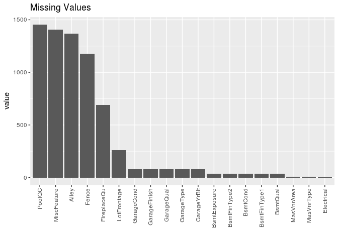
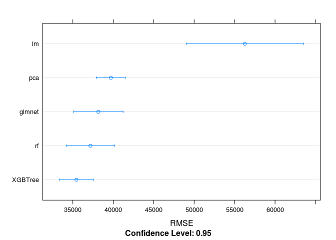

Beginner's Guide to Caret
================
Dennis Sobolewski
2018-02-28

Simplifying the Caret Framework
-------------------------------

Caret is an extremely useful R package that makes training, comparing, and tuning models easier. The goal of this exercise is to demonstrate the simplest implementation of Caret using the [Ames Housing Dataset](https://ww2.amstat.org/publications/jse/v19n3/decock.pdf). For this priblem we are trying to create a model for predicting the sale price of homes in Ames, Iowa. I remember being a n00b and struggling to find answers to basic modeling questions so I will try to address many of those beginner "gotcha" questions that once my life difficult. For the sake of this tutorial I will not touch on feature engineering besides simple pre-processing steps that come built in with Caret but it is an important step for maximizing the accuracy of a model.

The Data
--------

Once we remove the unnecessary "Id" column from our training dataset we are left with a mix of 80 numeric and categorical variables. If we take a look we also see there are a large number of missing values in our dataset.

``` r
library(here)
library(tidyverse)
library(caret)

train <- read.csv(here("data","train.csv"), stringsAsFactors = F)
train <- train %>% select(-Id)

#Count NAs per column and graph
map_df(train, ~sum(is.na(.))) %>% gather() %>% 
  filter(value > 0) %>%
  ggplot(.,aes(x = reorder(key,-value), y = value)) + 
  geom_bar(stat="identity") +
  labs(title = "Missing Values",x="") +
  theme(axis.text.x=element_text(angle=90,hjust=1,vjust=0.5))
```



Our first decision is what to do with this missing data. After reading through the data documentation it is not entirely clear if the missing values are due to data collection issues or if the absense simply means the value is "none" or 0 in numerical cases. Looking at the plot it appears there are many missing values for the PoolQC variable. It would make sense that many houses would not have a pool and this should in fact be replaced with the category "none". The missing values for the garage and basement variables all seem to be perfectly correlated making me think if a home did not have a garage they had NAs across the board for those. I am going to assume a missing value should be replaced with "none" if categorical or 0 if numeric. If we believed these were missing due to errors in data collection we would want to impute the missing values with our best estimate. Caret has a few methods for doing this in its preProcess function that are simple to use.

*Note: To replace the NAs for categorical data we will want these variables to be type = character. Once values are replaced we want to then change these to type = factor for modeling*

``` r
#Replace missing values with "none" or "0" based on categorical vs numeric 
train_num <- train %>% select_if(is.numeric) 
train_cat <- train %>% select_if(is.character) 

train_num[is.na(train_num)] <- 0
train_cat[is.na(train_cat)] <- "None"
train_cat <- map_df(train_cat,as.factor)

#Combine replaced dataframes  
train_pp <- cbind(train_cat,train_num)
rm(train_cat,train_num)
```

Setting our Training Framework
------------------------------

Now that we have our data in a clean format we are ready to define our Caret trainControl settings. These settings will determine how a model is evaluated so we can compare apples to apples when looking at results for different models. The most simple evaluation method is to train a model on some portion of the training data, predict the outcome on the portion that was withheld, and then measure the accuracy of the predicted vs actual values. In order to make sure we are not overfitting our model or working with a biased train/test set that could affect results it is best practice to use cross validation. In Caret we can use the createFolds function to create an index to be used for cross validation. Here we create 10 folds that we then feed into our trainControl index. Each model will be train on 9 of the folds and then predict the SalePrice on the 10th. This will continue until every fold's outcomes have been predicted based on the other 9 and the results will be averaged. This ensures each model is undergoing the same 10 fold cross validation so we are comparing their results fairly.

``` r
#define training folds and steps for modeling
##set.seed for reproducability when randomly choosing folding
set.seed(1108)

myFolds <- createFolds(train_pp$SalePrice,10)

myControl <- trainControl(
  verboseIter = F, #prints training progress to console
  savePredictions = T,
  index = myFolds
)
```

Lets get Modeling!
------------------

Now that we have our training method we are ready to start modeling. In the past I remember having a lot of uncertainty at this stage due to the factor data we have in our dataset. Regression models cannot handle factor data so should I create dummy variables prior to training my models? Shouls these dummy variables also be used for ensemble algorithms like random forest that are able to handle factors? It took me way too long to find out that when using the formula layout (y~.) in Caret it automatically turns all factors into dummy variables and that I was doing extra work for no reason. Also, using the formula method with algos like random forest is fine in most cases. For this write up I experimented with both and found the dummy variable version of random forest actually out performed the factor one.

The beauty of Caret is that it recognized algorithms from many different R packages. Once the framework for training and evaluating a model is built it is as easy as changing one variable in most cases to do the same thing on a completely different maching learning algorithm. A list of all models possible for Caret can be found [here](https://topepo.github.io/caret/available-models.html).

### Multiple Regression

We will start with a basic multiple regression model. For regression models it is almost always recommended to center and scale your data beforehand. Caret makes this simple with the preProcess settings in the train function. We will also use "nzv" to remove all varaibles with zero or near zero varianace. It is also also easy to create principal components to be used in our model by adding "pca" to preProcess which we will also explore. For PCA many near zero variance variables might be combined into useful information so we will want to use "zv" to only remove zero variance variables. Below shows the training process and best result for each method. Now we have RMSE values that we can use as a benchmark for comparing other modeling techniques. We can see that the PCA model drastically outperformed the regular multiple regression model.

``` r
lm <- train(
  SalePrice~.,
  data = train_pp,
  preProcess = c("nzv","center","scale"),
  metric = "RMSE",
  method = "lm",
  trControl = myControl
)

min(lm$results$RMSE)
```

    ## [1] 56259.7

``` r
lm_pca <- train(
  SalePrice~.,
  data = train_pp,
  preProcess = c("zv","center","scale","pca"),
  metric = "RMSE",
  method = "lm",
  trControl = myControl
)

min(lm_pca$results$RMSE)
```

    ## [1] 39702.75

### GLMNET

Glmnet is a package that fits a generalized linear model via penalized maximum likelihood. More information on how this works can be found [here](https://web.stanford.edu/~hastie/glmnet/glmnet_alpha.html). Glmnet is easily interpretable like a multiple regression model but avoids many of the common pitfalls in cases where there are many highly correlated variables. One of the main differences when using glmnet in the Caret framework is that there are tuning parameters. Caret makes it very simple to test many different combinations of tuning parameters by using a tuning grid. If the tuneGrid variable is not specified Caret will choose default values that may yield decent results but can probably be improved upon in most cases. Looking at the Caret [methods](https://topepo.github.io/caret/available-models.html) documentation we can see there are two variables that can be tuned: alpha and lambda. Alpha is always 0-1 while lambda can be infinite. The default settings choose a best lambda of 12563 for us which I will use as a base for choosing values. Glmnet can train many different values of lambda at once so adding a large sequence of these to your tuningGrid will not drastically affect run time. As we can see our optimal glmnet model was an improvement over our other regression models.

``` r
glmnet <- train(
  SalePrice~.,
  data = train_pp,
  preProcess = c("nzv","center","scale"),
  metric = "RMSE",
  method = "glmnet",
  trControl = myControl,
  tuneGrid = expand.grid(
    alpha = seq(0,1,.1),
    lambda = seq(1000,50000,100)
  )
)

min(glmnet$results$RMSE)
```

    ## [1] 38155.03

### Random Forest

Random Forest models are extremely easy to use with little or no pre-processing necessary. These models are based off of decision tree principals which make them highly adaptable to almost all types of input data. What you gain in ease-of-use you lose in interpretability however and random forest models are typically seen as a "black box" algorithm. When we look at the Caret documentation we can see the only variable that requires training is the mtry varaible. The default settings choose an optimal mtry of 131 so we will pick a range around that number to see if we can improve on this.

``` r
rf <- train(
  SalePrice~.,
  data = train_pp,
  metric = "RMSE",
  method = "rf",
  trControl = myControl,
  tuneGrid = expand.grid(
    mtry = seq(70, 150, 5)
  )
)

min(rf$results$RMSE)
```

    ## [1] 37171.53

### XGBoost

The [XGBoost](https://cran.r-project.org/web/packages/xgboost/vignettes/xgboostPresentation.html) package is another popular modeling tool in R and has been featured in multiple winning submissions for Kaggle online data science competitions. XGBoost creates gradient boosted tree models that can be finely tuned to maximize results. There is also an xgbLiner option for Caret that creates penalized regression models similar to GLMNET. The xgbTree method has many of the same benefits as random forest but requires the tuning of many parameters in order to acheieve the best results. Using the Caret documentation, [this](https://www.hackerearth.com/practice/machine-learning/machine-learning-algorithms/beginners-tutorial-on-xgboost-parameter-tuning-r/tutorial/) beginner's guide to XGBoost tuning, and good old fashioned trial and error I came up with the below tuning grid as a quick first stab. This is an example where experience is needed to find the best results and modeling can be a bit of an artform. I am certain these results could be improved upon with finer tuning.

``` r
xgbTree <- train(
  SalePrice~.,
  data = train_pp,
  metric = "RMSE",
  method = "xgbTree",
  trControl = myControl,
  tuneGrid = expand.grid(
    nrounds= 500,
    max_depth = c(4,6,8),
    eta = c(.05,0.1,0.2),
    gamma = 0,
    colsample_bytree = c(.5,.7),
    subsample = c(0.5,0.8),
    min_child_weight = 0
  )
)

min(xgbTree$results$RMSE)
```

    ## [1] 35447.37

Comparing Results
-----------------

Caret has an extremely useful resamples function for comparing the results of different models. After combining our models into a list we can use built in plots to compare each model based on the cross validated RMSE results. I find the built in dot plot to be easest to read. Here we are looking for not only the lowest RMSE value but also the least variation among the results for each validation fold. As we can see the XGBoost model performed best with a small variation among results. We can see below that the xgbTree model outperformed all others in these categories based on the below.

``` r
##Compare all models to choose the best one
mod_list <- list(lm = lm,pca = lm_pca,glmnet = glmnet,rf = rf, XGBTree = xgbTree)
resamp <- resamples(mod_list)

dotplot(resamp, metric = "RMSE")
```


